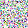
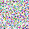
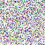

# ImageTools

## generate_png_image_size.py
- 指定した容量(KB)前後のPNGファイルを生成するツールです。
  - PNGファイルは`./output/size_spec/`配下に`output_{指定容量}.png`で保存されます。
- 1pxごとの色RGBAをランダムで設定することでPNGの圧縮効果をなくし、なるべく早く指定した容量に達することを願っています。
- 容量が増えるたびに生成完了までの時間がかかります。
例：10KB, 50KB, 100KBのファイルを生成します。
```python
create_pngs_with_sizes([100, 10, 50])
```

## generate_png_gpu.py
- `generate_png_image_size.py`の画像生成処理はCPUベースで処理を行っていたため、高速化を目的としてGPU側で処理を行う形に書き換えたものです。
- 使用方法は同じです。
- Apple Siliconの場合は`mps`が使用されますが、他にも`cuda`, `cpu`の順で使用できるものが選択されます。

### 例
以下の設定で実行
```
size = 1  # 初期画像サイズを10x10に設定
increase_step = 1  # 一度に増やすピクセル数
target_sizes_kb = [1, 3, 5, 7, 10]
```







※ 約1,3,5,7,10KBの画像が出力されます。

※ 一度に出力される画像は直前のサイズの画像を使い回すため、左上側のピクセルの色配置が同じになります。

## generate_movie_gpu.py
- `generate_png_gpu.py`と同じようにGPUをベースに動画ファイルを作成したいとおもって作りました。
- 画像と同じく1pxごとの色RGBAをランダムで設定するものになります。これにより圧縮効果がなくせているのかは知りません。
- 動画フレーム毎の画像生成は、GPUで生成されていそうですが、動画の保存に関してはCPUを使用するようなので、CPU使用率はそこそこ高いです。
- MB単位で指定します。

### 例
以下の設定で実行
```
resolution=(320, 240), fps=30
target_sizes_mb = [5]
```


※ 解像度:320x240、フレームレート:30、5MBの動画が出力されます。(上記画像はgifに変換したものです。)

## generate_qr.py
- 入力した文字列からQRコードを生成してプレビュー出力と画像の出力ができる


- 実行するとGUIが表示される
- 文字列タブ
  - 入力した文字列をそのままQRコードとして出力する
- 内部テスト共有タブ
  - 入力したAndroidの内部テストビルド番号を元に共有用URLのQRコードとして出力
  - アプリのパッケージはコード内の`application_id`へ入力する
- Generateボタン
  - QRコードを生成しプレビュー表示
- Export QRボタン
  - プレビュー表示したQRコードをPNG画像で保存